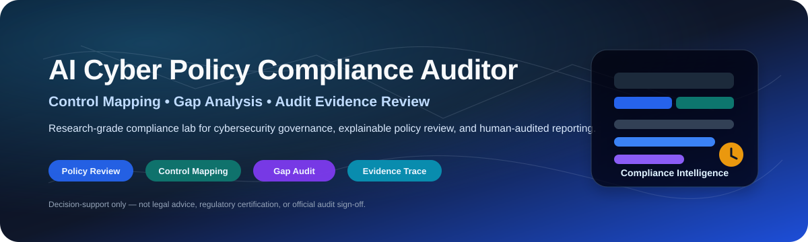
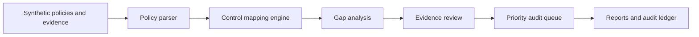
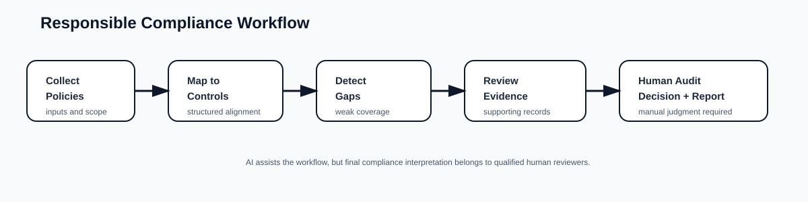

<p align="center">
  
</p>

<h1 align="center">AI Cyber Policy Compliance Auditor</h1>

<p align="center">
  <b>A research-grade cybersecurity governance lab for policy-control mapping, evidence-readiness review, compliance-gap analysis, priority audit queues, and transparent human-reviewed reporting.</b>
</p>

<p align="center">
  <a href="../../actions/workflows/python-checks.yml"></a>
  
  
  
  
</p>

---

## Overview

**AI Cyber Policy Compliance Auditor** is an independent academic research prototype for studying how AI-assisted workflows can support cybersecurity policy review, compliance-control mapping, evidence triage, and governance-gap detection.

The repository uses fictional synthetic policies, controls, evidence records, access logs, and framework-style mappings by default. This makes it safe for research, teaching, reproducible experimentation, and portfolio demonstration without exposing real company compliance data.

The project is designed around one careful research question: **can an AI-assisted compliance workflow help reviewers identify policy-control gaps, organize audit evidence, and produce transparent reports while keeping all final judgments under human governance?**

It is useful for research and teaching in:

- Cybersecurity governance, risk, and compliance.
- Cyber policy analysis and control mapping.
- Evidence-readiness and audit-preparation workflows.
- Gap analysis for security policy coverage.
- Explainable governance review.
- Responsible AI for compliance decision support.
- Human-in-the-loop audit-support systems.

> **Compliance-support boundary:** this repository is a research and decision-support prototype only. It is not legal advice, official ISO certification, SOC 2 attestation, regulatory approval, audit sign-off, or a replacement for qualified auditors, security teams, risk officers, counsel, or compliance professionals.

---

## Research objective

Can an AI-assisted cyber-policy auditing workflow map security policies and controls to framework-style categories, evaluate evidence completeness, identify governance gaps, and generate transparent audit-support reports without replacing certified professionals?

| Research question | Evidence generated locally |
|---|---|
| Which controls map to ISO 27001-style, NIST-style, and SOC 2-style categories? | Framework mapping table and mapping-confidence fields |
| Which controls lack strong evidence? | Evidence completeness audit and gap flags |
| Which areas need urgent compliance review? | Risk-prioritized gap register |
| What actions should a GRC team review next? | Remediation checklist with review windows |
| Are evidence access patterns appropriate? | Synthetic access-log audit |
| Can compliance-review runs be reproduced? | CSV outputs, JSON summary, Markdown report, and hash-chained audit ledger |

---

## Architecture

<p align="center">
  
</p>



<p align="center">
  
</p>

The workflow is intentionally transparent. Each output is a **review artifact**, not an automatic compliance determination.

---

## Core capabilities

| Capability | What it does | Why it matters |
|---|---|---|
| Synthetic GRC corpus | Builds fictional policies, controls, evidence records, and access events | Enables safe experiments without real company data |
| Framework-style mapping | Maps controls to ISO 27001-style themes, NIST-style functions, and SOC 2-style trust categories | Supports structured compliance review |
| Evidence completeness audit | Scores evidence count, quality, freshness, scope coverage, and evidence-type diversity | Makes audit readiness visible |
| Compliance gap analysis | Combines risk, mapping confidence, evidence quality, and review age | Highlights weak or missing coverage |
| Remediation planning | Produces human-review prompts and target review windows | Helps prioritize GRC follow-up |
| Access-log audit | Flags unusual synthetic access events such as bulk export or after-hours review | Demonstrates governance monitoring patterns |
| Hash-chained ledger | Records reproducible run events | Improves traceability and inspection |
| Reporting | Produces Markdown reports, CSVs, JSON summaries, and figures | Makes the lab publication and portfolio ready |

---

## Run today — no real company data needed

Install dependencies:

```bash
python -m pip install -r requirements.txt
```

Run the synthetic compliance lab:

```bash
python scripts/run_synthetic_compliance_lab.py
```

Optional controls:

```bash
python scripts/run_synthetic_compliance_lab.py --controls 64 --seed 42
```

Windows quick start:

```bat
cd %USERPROFILE%\AI-Cyber-Policy-Compliance-Auditor
git pull

py -m venv .venv
.venv\Scripts\activate

python -m pip install --upgrade pip
python -m pip install -r requirements.txt
python scripts\run_synthetic_compliance_lab.py --controls 64 --seed 42
```

Run tests:

```bash
python -m pytest -q
```

---

## Generated local outputs

```text
outputs/results/synthetic_security_policies.csv
outputs/results/synthetic_control_inventory.csv
outputs/results/synthetic_evidence_records.csv
outputs/results/synthetic_access_log.csv
outputs/results/synthetic_framework_mapping.csv
outputs/results/synthetic_evidence_audit.csv
outputs/results/synthetic_compliance_gap_audit.csv
outputs/results/synthetic_access_audit.csv
outputs/results/synthetic_remediation_plan.csv
outputs/results/synthetic_compliance_summary.json
outputs/reports/synthetic_cyber_compliance_report.md
outputs/audit/cyber_policy_compliance_audit_log.jsonl

outputs/figures/synthetic_gap_priority.png
outputs/figures/synthetic_framework_coverage.png
outputs/figures/synthetic_evidence_completeness.png
outputs/figures/synthetic_owner_gap.png
outputs/figures/synthetic_remediation_windows.png
outputs/figures/synthetic_access_reviews.png
```

---

## Compliance-support modules

| Module | Purpose |
|---|---|
| `synthetic.py` | Creates fictional policies, controls, evidence, and access logs |
| `mapping.py` | Maps controls to ISO/NIST/SOC2-style framework categories |
| `evidence.py` | Scores evidence completeness, freshness, scope, and quality |
| `risk.py` | Scores compliance gaps and access-log review signals |
| `remediation.py` | Produces human-review action prompts and review windows |
| `audit.py` | Maintains a hash-chained audit ledger |
| `visualization.py` | Produces local figures for review reports |
| `reporting.py` | Builds Markdown compliance-support reports |

---

## Responsible compliance boundary

This project supports cyber policy review, control mapping research, evidence triage, and compliance-report drafting. Real compliance work requires actual evidence validation, auditor independence, legal review, operating-effectiveness testing, management assertions, scope definition, sampling methodology, and formal governance.

The system should never be used as the sole basis for ISO certification, SOC 2 attestation, regulatory reporting, legal conclusions, audit opinions, vendor approvals, customer assurances, or production GRC decisions.

---

## Repository map

```text
.
├── assets/
│   ├── banner.svg
│   ├── compliance_auditor_architecture.svg
│   └── compliance-workflow.svg
├── docs/
│   ├── governance-and-boundary.md
│   ├── reproducibility-playbook.md
│   └── publication-readiness-plan.md
├── src/cybercompliance/
│   ├── synthetic.py
│   ├── mapping.py
│   ├── evidence.py
│   ├── risk.py
│   ├── remediation.py
│   ├── audit.py
│   ├── visualization.py
│   └── reporting.py
├── scripts/
│   └── run_synthetic_compliance_lab.py
├── outputs/                       # generated locally, not committed by default
├── requirements.txt
├── CITATION.cff
├── LICENSE
└── README.md
```

---

## Documentation

- [`docs/governance-and-boundary.md`](docs/governance-and-boundary.md): intended use, non-intended use, and human-review requirements.
- [`docs/reproducibility-playbook.md`](docs/reproducibility-playbook.md): run records, evidence bundles, and interpretation rules.
- [`docs/publication-readiness-plan.md`](docs/publication-readiness-plan.md): academic framing and future paper-extension ideas.

---

## Future extensions

| Extension | Requirement before claiming results |
|---|---|
| Multi-framework support | Clear mapping logic and validation |
| Evidence confidence scoring | Human-reviewed methodology |
| Policy version comparison | Change tracking and provenance |
| Dashboard interface | Access control and audit logging |
| LLM-assisted explanation layer | Traceability, uncertainty labeling, and review guardrails |
| Real evidence import | Data minimization, security review, and legal/compliance approval |

---

## Limitations

- Framework mappings are transparent research proxies, not official interpretations.
- Synthetic data validates the workflow, not real compliance readiness.
- Evidence scores are review prompts, not audit conclusions.
- Official compliance outcomes require qualified auditors, real scope, real evidence, and formal review.
- This repository does not provide legal, regulatory, or certification advice.

## Citation

Citation metadata is available in [`CITATION.cff`](CITATION.cff).

## License

Released under the [MIT License](LICENSE). Synthetic examples are provided for research and education only.
