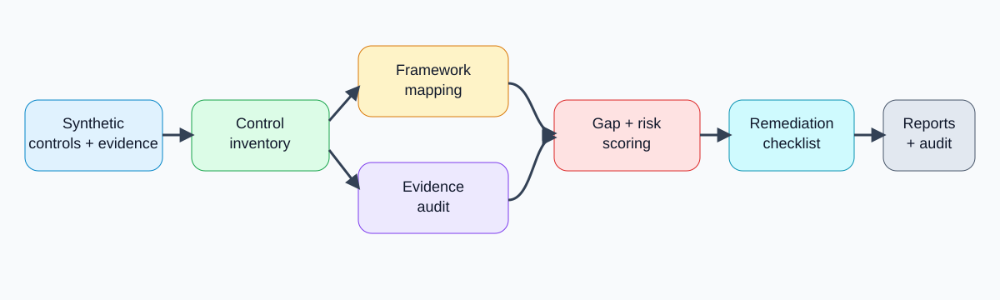
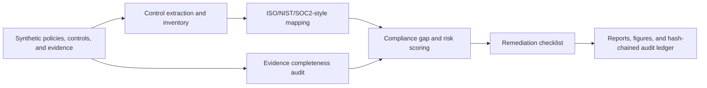

# AI Cyber Policy Compliance Auditor

<p align="center"><strong>Independent research-grade AI cyber policy compliance auditor for mapping synthetic security controls to ISO 27001-style, NIST-style, and SOC 2-style categories, auditing evidence completeness, identifying control gaps, and generating evidence-based compliance-support reports.</strong></p>

<p align="center">
  <a href="../../actions/workflows/python-checks.yml"></a>
  <a href="LICENSE"></a>
  
  
</p>

> **Compliance-support boundary:** this repository uses fictional synthetic policies, controls, evidence records, access logs, and framework-style mappings by default. It is independent cybersecurity/GRC research infrastructure only. It is not legal advice, official ISO certification, SOC 2 attestation, regulatory approval, or a replacement for qualified auditors, counsel, or compliance professionals.

---

## Research objective

Can an AI-assisted cyber policy compliance auditor map security policies and controls to major compliance framework categories, evaluate evidence completeness, identify control gaps, and generate transparent audit-ready reports without replacing certified compliance professionals?

| Research question | Evidence generated locally |
| --- | --- |
| Which controls map to ISO 27001, NIST, and SOC 2 style categories? | Framework mapping table and mapping confidence scores |
| Which controls lack strong evidence? | Evidence completeness audit and gap flags |
| Which areas need urgent compliance review? | Risk-prioritized compliance gap audit |
| What actions should a GRC team review next? | Remediation checklist with review windows |
| Are evidence access patterns appropriate? | Synthetic access-log audit |
| Can compliance-review runs be reproduced? | Hash-chained audit ledger |

---

## Architecture

<p align="center"></p>



---

## Run today — no real company data needed

```bash
python scripts/run_synthetic_compliance_lab.py
```

Windows quick start:

```bat
cd %USERPROFILE%\AI-Cyber-Policy-Compliance-Auditor
git pull

py -m venv .venv
.venv\Scripts\activate

python -m pip install --upgrade pip
python -m pip install -r requirements.txt
python scripts/run_synthetic_compliance_lab.py
```

Optional controls:

```bash
python scripts/run_synthetic_compliance_lab.py --controls 64 --seed 42
```

---

## Generated local outputs

```text
outputs/results/synthetic_security_policies.csv
outputs/results/synthetic_control_inventory.csv
outputs/results/synthetic_evidence_records.csv
outputs/results/synthetic_access_log.csv
outputs/results/synthetic_framework_mapping.csv
outputs/results/synthetic_evidence_audit.csv
outputs/results/synthetic_compliance_gap_audit.csv
outputs/results/synthetic_access_audit.csv
outputs/results/synthetic_remediation_plan.csv
outputs/results/synthetic_compliance_summary.json
outputs/reports/synthetic_cyber_compliance_report.md
outputs/audit/cyber_policy_compliance_audit_log.jsonl

outputs/figures/synthetic_gap_priority.png
outputs/figures/synthetic_framework_coverage.png
outputs/figures/synthetic_evidence_completeness.png
outputs/figures/synthetic_owner_gap.png
outputs/figures/synthetic_remediation_windows.png
outputs/figures/synthetic_access_reviews.png
```

---

## Compliance-support modules

| Module | Purpose |
| --- | --- |
| Synthetic generator | Builds fictional policies, controls, evidence records, and access events |
| Framework mapping | Maps controls to ISO 27001-style themes, NIST-style functions, and SOC 2-style trust categories |
| Evidence audit | Scores evidence count, quality, freshness, scope coverage, and evidence-type diversity |
| Gap audit | Combines inherent risk, implementation posture, mapping confidence, evidence quality, and review age |
| Remediation planner | Produces human-review action prompts and target review windows |
| Access audit | Flags unusual synthetic access events such as bulk export or after-hours review |
| Reporting | Produces Markdown compliance-support reports, figures, CSVs, JSON, and audit logs |

---

## Independent compliance boundary

This project supports cyber policy review, control mapping research, evidence triage, and compliance-report drafting. Real compliance work requires actual evidence validation, auditor independence, legal review, control operating-effectiveness testing, management assertions, scope definition, sampling methodology, and formal governance.

The system should never be used as the sole basis for ISO certification, SOC 2 attestation, regulatory reporting, legal conclusions, audit opinions, vendor approvals, customer assurances, or production GRC decisions.

---

## Repository map

```text
src/cybercompliance/
  synthetic.py       # fictional policies, controls, evidence, and access logs
  mapping.py         # ISO/NIST/SOC2-style framework mapping proxies
  evidence.py        # evidence completeness scoring
  risk.py            # compliance gap and access-log audit
  remediation.py     # remediation checklist generation
  audit.py           # hash-chained audit ledger
  visualization.py   # local figures
  reporting.py       # Markdown compliance-support report
scripts/
  run_synthetic_compliance_lab.py
docs/
  methodology.md
  compliance_boundary.md
  synthetic_lab.md
  report_template.md
tests/
  test_synthetic.py
  test_compliance_modules.py
  test_pipeline.py
  test_audit.py
```

---

## Limitations

- Framework mappings are transparent research proxies, not official interpretations.
- Synthetic data validates the pipeline but does not prove real-world compliance readiness.
- Evidence scores are review prompts, not audit conclusions.
- Official compliance outcomes require qualified auditors, real scope, real evidence, and formal review.
